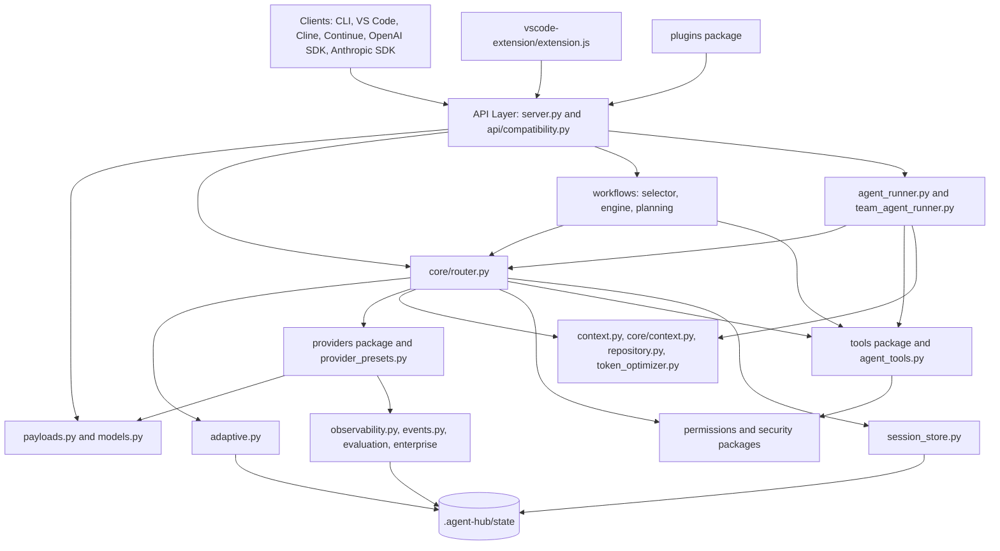
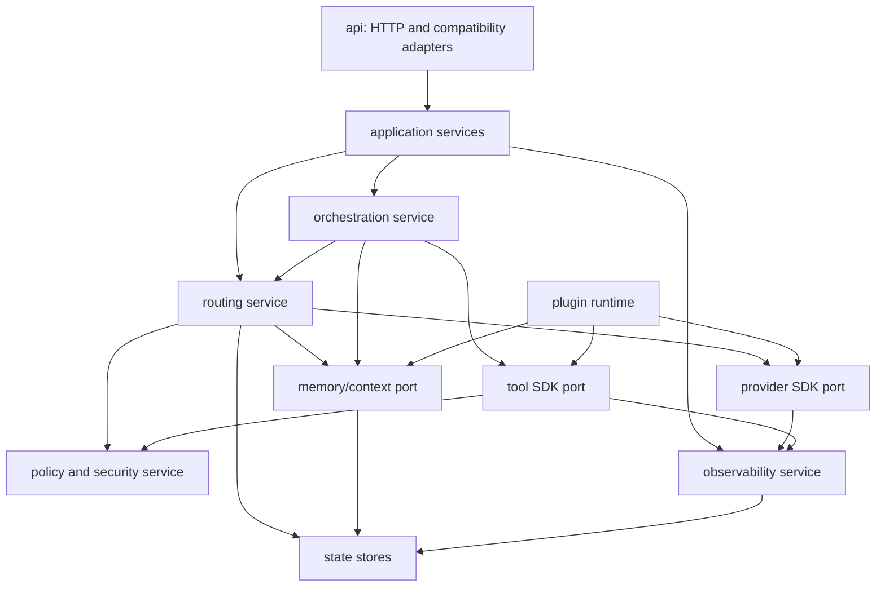

# Agent-Hub Platform Architecture Roadmap

This document maps the current Agent-Hub architecture and lays out the
priority path from personal AI router to open-source AI infrastructure
platform. It is based on the current repository structure, existing docs, and
the backend import graph.

## Executive Summary

Agent-Hub already has strong foundations: OpenAI and Anthropic compatibility,
provider routing, health-aware failover, tool execution, repository context,
deterministic workflows, plugin manifests, security checks, observability
events, VS Code integration, and adaptive routing analytics.

The next platform step is not to add every feature directly into the current
large modules. The highest leverage move is to turn the internal foundations
into stable extension contracts while steadily shrinking the largest files:

- `agent_hub/agent_runner.py`: 4714 lines
- `agent_hub/core/router.py`: 2779 lines
- `agent_hub/agent_tools.py`: 2150 lines
- `agent_hub/server.py`: 1935 lines
- `agent_hub/cli.py`: 1653 lines
- `agent_hub/config.py`: 1302 lines
- `agent_hub/reasoning.py`: 1169 lines
- `agent_hub/providers/shared.py`: 863 lines

The roadmap below preserves backward compatibility by keeping existing
endpoints, config fields, model aliases, provider names, and extension behavior
stable while introducing new internal ports and adapters.

## Current Architecture Map



## Boundary Inventory

| Boundary | Current modules | Current maturity | Main issue |
| --- | --- | --- | --- |
| API layer | `server.py`, `api/compatibility.py`, `payloads.py` | Strong compatibility coverage | HTTP routing, dashboard, diagnostics, streaming, and endpoint logic still live in one large handler |
| Routing | `core/router.py`, `core/provider_attempts.py`, `core/routing_policy.py`, `core/health.py`, `adaptive.py` | Strong runtime behavior with provider execution now separated from scoring | Router still owns context prep, tool loops, health writes, and adaptive outcomes |
| Providers | `providers/*`, `provider_presets.py`, `response_normalization.py` | Good built-in adapter base, descriptors, SDK template, and a thin compatibility facade | Shared provider payload/research helpers still need to be split into SDK-ready modules |
| Tools | `tools/*`, `agent_tools.py` | Good permissioned execution foundation | Two tool systems coexist: modern MCP-shaped tools and legacy workspace toolbox logic |
| Sessions | `session_store.py`, runner memory | Useful persistence | No explicit session service boundary or memory tier contract |
| Permissions and security | `permissions.py`, `security/*`, `tools/permissions.py` | Strong local safety checks | Needs a formal threat model, policy tests per boundary, and provider/tool isolation contracts |
| Context management | `context.py`, `core/context.py`, `repository.py`, `token_optimizer.py` | Useful repository-aware context | Semantic compression, retrieval, and long-term memory are only foundations |
| Orchestration | `agent_runner.py`, `team_agent_runner.py`, `workflows/*`, `agents/*` | Good deterministic workflows | Agent role APIs, parallelism, consensus, and retries are not yet extension-grade |
| Observability | `observability.py`, `events.py`, `evaluation`, `/metrics`, `/v1/optimization` | Good local diagnostics | No trace IDs across every boundary, no OpenTelemetry/Grafana export contract |
| Extension integration | `vscode-extension/extension.js`, backend snapshot | Feature-rich | Single large extension file and backend snapshot drift make contribution harder |
| Plugins | `plugins/*`, `docs/plugins.md` | Safe manifest/trust foundation | Plugins do not execute code or register live provider/tool/router implementations yet |

## Dependency Graph

The backend currently has 94 Python modules and 291 internal import edges. The
highest fan-out modules are:

```text
agent_hub.core.router: 23 deps
agent_hub.server: 16 deps
agent_hub.cli: 12 deps
agent_hub.providers.shared: 9 deps
agent_hub.providers.__init__: 8 deps
agent_hub.agent_runner: 7 deps
agent_hub.team_agent_runner: 7 deps
agent_hub.workflows.engine: 7 deps
agent_hub.tools.runtime: 7 deps
```

Critical dependency observations:

- `server.py` depends directly on routing, workflows, runners, observability,
  plugins, enterprise audit, security redaction, and compatibility helpers.
- `core/router.py` is the central runtime dependency hub. This is appropriate
  for routing, but it should not keep absorbing context, provider execution,
  adaptive learning, and event-recording responsibilities.
- `providers/__init__.py` is now a compatibility facade for provider imports,
  but `providers/shared.py` still contains mixed payload, retry, streaming, and
  local research helpers that should become SDK-ready boundaries.
- `agent_runner.py` and `agent_tools.py` contain many policy helpers that
  should become testable services under `orchestration`, `workspace`, and
  `context`.

## Target Architecture



The key design goal is simple: API handlers should call application services;
application services should depend on ports; providers, tools, memory, and
plugins should be adapters behind those ports.

## Migration Principles

- Preserve existing endpoints and model aliases.
- Keep config compatibility through additive fields and migrations.
- Extract services behind old module facades before moving callers.
- Keep tests green after each extraction.
- Avoid executing third-party plugin code until trust, permissions, and
  sandboxing are enforceable.
- Prefer thin public SDK contracts over exposing internal classes.

## Prioritized Roadmap

### P0: Stabilize Architecture Contracts

| Recommendation | Why it matters | Complexity | Impact | Migration steps | Compatibility |
| --- | --- | --- | --- | --- | --- |
| Create `agent_hub/application/` services for chat, auto workflow, diagnostics, and feedback | Removes endpoint logic from `server.py` and gives SDKs a stable internal API | Medium | High | Add service classes that wrap existing router/runners; move one endpoint group at a time; keep handler methods as delegates | Endpoints and response schemas remain unchanged |
| Continue provider extraction from `providers/shared.py` into payload, retry, streaming, and local research helper modules | Makes provider SDK realistic and reduces merge risk after the facade split | Medium | High | Keep classes re-exported from `providers/__init__.py`; move helper clusters behind stable helper modules; preserve monkeypatch shims | Existing imports continue through re-exports |
| Continue extracting router runtime services after `core/provider_attempts.py` | Separates ranking from execution/failover mechanics | High | High | Move context preparation, tool-loop execution, and health/adaptive recording behind smaller services | Routing decisions and failover payloads remain unchanged |
| Convert architecture guardrails into package-boundary tests | Prevents future large-module regression | Low | High | Add import-rule tests for API -> application -> core -> adapters layering | No runtime behavior change |

### P1: Provider Expansion And SDK

| Recommendation | Why it matters | Complexity | Impact | Migration steps | Compatibility |
| --- | --- | --- | --- | --- | --- |
| Expand the provider SDK template around `ProviderAdapter`, `ChatRequest`, `ChatResponse`, and `StreamChunk` | New providers should fit under 100 lines when they are OpenAI-compatible | Medium | Very high | Grow `agent_hub/providers/sdk.py` from the initial descriptor/template base into conformance helpers and examples | Existing providers can adopt gradually |
| Add OpenAI-compatible preset mappings for Together AI, Fireworks, DeepInfra, Novita, Cerebras, Hyperbolic, Nebius, vLLM, LM Studio, and local endpoints | Most requested providers can be added through base URL, headers, model IDs, and normalization | Medium | Very high | Extend `provider_presets.py`; add config examples; add mocked payload tests | Existing provider configs stay valid |
| Split provider capability metadata from provider config | Enables marketplace/provider discovery without editing core config | Medium | High | Add `ProviderDescriptor` with capabilities, auth scheme, pricing, endpoints; generate defaults from descriptors | Keep `AgentConfig` as the runtime config shape |
| Add provider conformance tests | Prevents adapter drift across many providers | Medium | High | Shared test suite for payload, auth, streaming, errors, tools, cost estimate | No user-facing change |

### P2: Smart Routing As A Public Product

| Recommendation | Why it matters | Complexity | Impact | Migration steps | Compatibility |
| --- | --- | --- | --- | --- | --- |
| Formalize routing strategies as plugins: cheapest, fastest, best, coding, private, adaptive | Turns internal scoring into an ecosystem surface | Medium | Very high | Add `RoutingStrategy` protocol; wrap current scoring modes; expose read-only decision context | Existing route modes keep names |
| Add explanation objects for every score component | Builds trust and supports enterprise analytics | Medium | High | Return optional `score_breakdown` under existing detailed routing flag | Hidden unless `expose_routing_details=true` |
| Expand adaptive learning to provider/model/role/workflow dimensions with retention policy | Makes self-learning sustainable over long installs | Medium | High | Add versioned state schema and compaction; migrate current `adaptive_learning.json` | Old state loaded best-effort |
| Add route simulation API | Lets users and CI test routing without spending tokens | Low | High | Add `POST /v1/routing/simulate` using current `recommend_models` and decision explainers | Additive endpoint |

### P3: Multi-Agent Platform

| Recommendation | Why it matters | Complexity | Impact | Migration steps | Compatibility |
| --- | --- | --- | --- | --- | --- |
| Create an `agents` role registry for planner, researcher, coder, reviewer, security, documentation, finalizer, validator | Turns built-in roles into configurable platform roles | Medium | High | Move prompt/role definitions out of runner helpers; allow config/plugin registration | Existing `group_roles` continues to work |
| Extract orchestration primitives: stage, branch, join, vote, critique, retry | Enables swarms without hard-coding every workflow | High | Very high | Build primitives around existing deterministic workflows; add tests with fake providers | Existing `/v1/workflows/*` still call deterministic plans |
| Add controlled parallel execution | Improves research, planning, and review without always paying consensus cost | High | High | Start with parallel planner/research branches; bounded concurrency and budget controls | Off by default or auto-mode only |
| Add custom agent creation API | Makes Agent-Hub a platform, not just a router | Medium | High | Add `/v1/agents` CRUD over local config/state; validate permissions | Keep static config as source of truth initially |

### P4: Token Economy And Memory

| Recommendation | Why it matters | Complexity | Impact | Migration steps | Compatibility |
| --- | --- | --- | --- | --- | --- |
| Define memory tiers: request, session, workspace, long-term | Gives context management a stable mental model | Medium | High | Add `memory/` package with ports; wrap `SessionStore`, repository context, and context cache | Current session files remain valid |
| Add semantic compression interface | Large projects need better summaries than truncation | High | High | Start with local deterministic compression, then optional embedding-backed summarizers | Existing context compaction remains fallback |
| Add retrieval-backed workspace memory | Differentiates Agent-Hub for large repos | High | Very high | Introduce pluggable vector store interface; default to no dependency/local JSON index | Off by default, no new dependency required |
| Add token budget ledger per request/workflow | Makes cost and context predictable | Medium | High | Extend `token_budget.py` with stage budgets and actual usage | Existing limits remain accepted |

### P5: Open Plugin Ecosystem

| Recommendation | Why it matters | Complexity | Impact | Migration steps | Compatibility |
| --- | --- | --- | --- | --- | --- |
| Move from manifest-only plugins to capability registration | Lets third parties add providers/tools/memory safely | High | Very high | Implement registration for trusted local plugins first; still block execution by default | Manifest-only behavior remains valid |
| Add `agent-hub install <plugin>` | Makes ecosystem adoption real | Medium | High | Implement install into `.agent-hub/plugins`; validate manifest and trust registry | Existing manual plugin dirs continue |
| Add sandbox backends in phases: disabled, local process, Docker, WASM | Plugin execution must not compromise users | High | Very high | Start with local process plus strict scopes; Docker/WASM later | Default remains disabled |
| Publish plugin author docs and examples | Community adoption needs copy-pasteable patterns | Low | High | Add provider/tool/router/memory sample plugins | No runtime change |

### P6: Developer Platform

| Recommendation | Why it matters | Complexity | Impact | Migration steps | Compatibility |
| --- | --- | --- | --- | --- | --- |
| Generate Python and TypeScript SDKs from endpoint schemas | Makes Agent-Hub embeddable infrastructure | Medium | High | Add typed schema definitions for current endpoints; generate clients in `sdk/` | REST APIs remain stable |
| Add OpenAPI spec | Unlocks docs, clients, and enterprise review | Medium | High | Start from current endpoints and response fixtures; wire into release validation | Additive artifact |
| Split VS Code extension into modules | Improves contribution velocity | Medium | Medium | Extract API client, dashboard rendering, chat view, state, and commands | Packaged extension behavior remains unchanged |
| Add Docker Compose examples for common provider stacks | Helps adoption by local and team users | Low | Medium | Add profiles for Ollama, LM Studio/vLLM, Agent-Hub | Existing Dockerfile remains |

### P7: Observability

| Recommendation | Why it matters | Complexity | Impact | Migration steps | Compatibility |
| --- | --- | --- | --- | --- | --- |
| Add request trace IDs across API, router, provider, tool, workflow, adaptive events | Makes debugging multi-stage flows possible | Medium | Very high | Thread `request_id` everywhere; add `trace_id` where a workflow has multiple requests | Existing event fields remain |
| Add OpenTelemetry export option | Enterprises expect standard traces and metrics | Medium | High | Optional dependency or OTLP JSON exporter; keep current JSONL as default | Off by default |
| Add Grafana dashboards | Meets phase 8 enterprise visibility goal | Low | High | Add `deploy/grafana` dashboards for provider health, costs, latency, failures | Additive files |
| Add analytics retention and compaction | Prevents local state growth | Low | Medium | Add retention config for events, adaptive data, sessions | Defaults preserve current behavior |

### P8: Security And Trust

| Recommendation | Why it matters | Complexity | Impact | Migration steps | Compatibility |
| --- | --- | --- | --- | --- | --- |
| Write a formal threat model | Security work needs shared assumptions | Low | Very high | Add `docs/threat-model.md`; cover providers, tools, plugins, local files, prompts, diagnostics | Documentation only |
| Centralize shell/file/network policy decisions | Reduces bypass risk across tools and plugins | Medium | Very high | Move scattered checks into policy services; keep old helper wrappers | Existing tool behavior remains |
| Add prompt-injection boundaries for repository context and tool outputs | Tools and retrieved context can steer models | Medium | High | Mark untrusted context blocks and enforce tool instruction separation | Prompt format remains compatible |
| Add provider isolation rules | Prevents accidental private context leakage | Medium | High | Extend provider permission policy with data categories and route constraints | Existing approval modes continue |

### P9: Differentiation

| Recommendation | Why it matters | Complexity | Impact | Migration steps | Compatibility |
| --- | --- | --- | --- | --- | --- |
| Productize adaptive routing dashboard | This is the strongest current differentiator | Medium | Very high | Expand `/v1/optimization`, dashboard cards, VS Code insights, route simulation | Additive UI/API |
| Build universal router profiles | Lets any app connect once and get intelligent provider access | Medium | Very high | Add profiles for coding, research, private, cheapest, fastest, enterprise | Existing route names remain |
| Add autonomous fallback chains with policy controls | Makes Agent-Hub more reliable than direct provider use | Medium | High | Let users define fallback policies by task, provider, cost, privacy, quality | Current sequential route fallback remains default |
| Add token pooling only within provider terms and user-owned quotas | Can reduce cost but must avoid abuse | High | Medium to high | Implement quota-aware distribution across configured user accounts/providers; no scraping or bypassing | Opt-in and policy-limited |
| Add bounded agent swarms | Differentiates from simple routers | High | High | Use orchestration primitives, budget caps, and validation gates | Off by default |

## Phase Delivery Plan

### Phase A: Refactor Without Behavior Change

1. Create application service layer.
2. Split provider package.
3. Extract router provider-attempt executor. Completed with `core/provider_attempts.py`.
4. Extract workspace tool policy from `agent_runner.py` and `agent_tools.py`.
5. Add import-boundary tests.

Exit criteria:

- `python -m unittest discover` passes.
- Existing API golden fixtures pass.
- Existing configs and VS Code extension still work.
- No endpoint or response-shape changes without fixture updates.

### Phase B: Provider SDK And Universal Connector

1. Add provider SDK template and conformance tests.
2. Add descriptor-based presets for the requested provider list.
3. Publish provider author docs.
4. Add route simulation for provider selection.

Exit criteria:

- New OpenAI-compatible providers require no custom adapter code unless their
  API shape differs.
- Provider SDK example is under 100 lines.
- Provider conformance suite covers auth, payload, error, streaming, tools, and
  cost estimates.

### Phase C: Platform APIs

1. Add OpenAPI spec.
2. Add Python and TypeScript SDK packages.
3. Split VS Code extension modules.
4. Add agent CRUD and workflow template APIs.

Exit criteria:

- Agent-Hub can be used as a library, local server, or drop-in API endpoint.
- SDK tests run against the local server.
- Extension code has isolated API/client/render modules.

### Phase D: Ecosystem And Enterprise

1. Enable trusted plugin capability registration.
2. Add sandbox execution backends.
3. Add OpenTelemetry and Grafana.
4. Add threat model and policy hardening.

Exit criteria:

- Trusted plugins can register providers/tools without editing core code.
- Plugin execution is denied by default and scope-checked when enabled.
- Enterprise diagnostics are useful without leaking secrets.

## Backward Compatibility Checklist

- Keep `/v1/chat/completions`, `/v1/responses`, `/v1/messages`, `/v1/agent`,
  `/v1/auto`, `/v1/route`, `/agent`, `/api/v1/chat/completions`, and
  `/openrouter/v1/chat/completions`.
- Keep model aliases such as `agent-hub`, `agent-hub-coding`,
  `agent-hub-auto`, `agent-hub-local`, and `agent:<name>`.
- Keep existing config loading and migration behavior.
- Keep manifest-only plugins valid.
- Keep JSONL state readable with best-effort migrations.
- Keep debug/diagnostic endpoints redacted.
- Keep the backend snapshot generation workflow for VS Code packaging.

## Near-Term Recommended PR Sequence

1. Add `agent_hub/application/services.py` and move `/v1/auto`,
   `/v1/feedback`, and `/v1/optimization` behind services.
2. Continue splitting `providers/shared.py` while preserving facade re-exports.
3. Add provider SDK template and provider descriptor model.
4. Add OpenAI-compatible presets for Together AI, Fireworks, DeepInfra,
   Novita, Cerebras, Hyperbolic, Nebius, LM Studio, vLLM, and local endpoints.
5. Extract the next router runtime service after provider attempts.
6. Add trace IDs across routing, workflow, tool, and adaptive events.
7. Add OpenAPI spec and SDK generation foundation.
8. Add plugin provider registration for trusted local plugins.

This sequence maximizes real-world usefulness and adoption while reducing the
maintenance risks that would otherwise come from adding more features directly
to the current largest modules.
