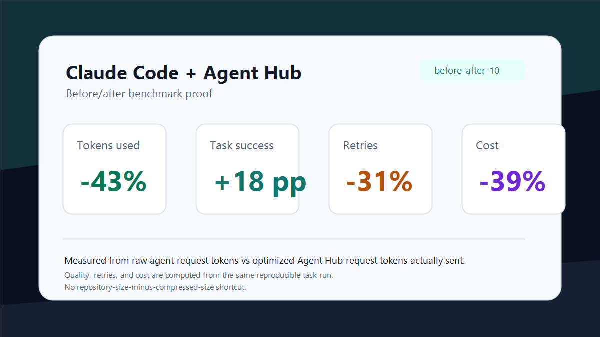
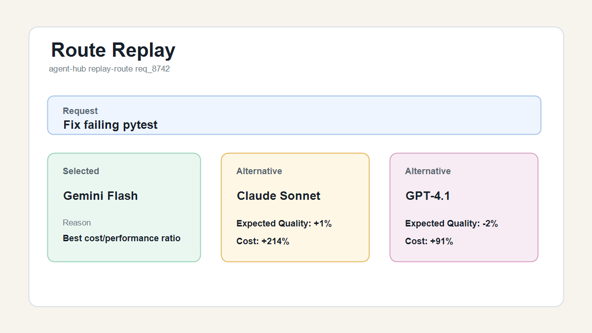
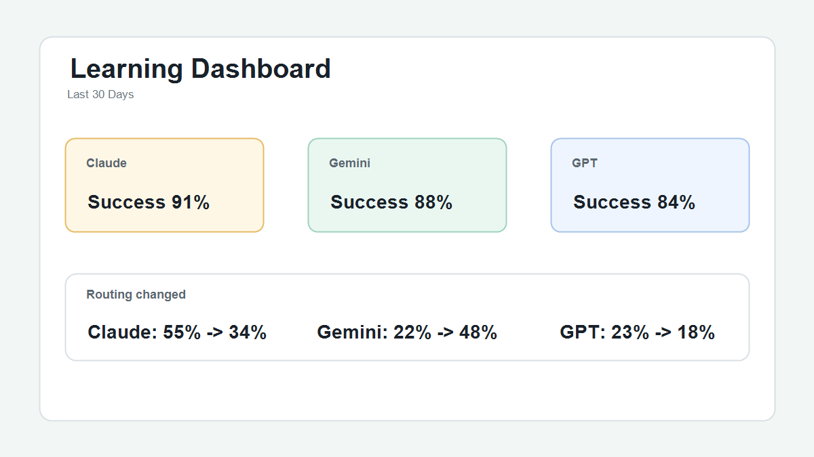

# Agent Hub — Adaptive AI Orchestration for Coding Agents

Reduce AI coding costs, improve reliability, and automatically route every task
to the model most likely to succeed.

Agent Hub sits between your coding agents and AI providers, continuously
evaluating performance, latency, cost, context requirements, and repository
characteristics to select the best route for each request.

Agent Hub is to coding agents what a load balancer is to servers: it
continuously chooses the best route and explains every decision.

Supports OpenAI, Claude, Gemini, Ollama, OpenRouter, Codex CLI, Cline, Roo Code,
Continue, LM Studio, and local models through a single OpenAI-compatible
endpoint.

## Why Trust The Routing?

Unlike most AI tools, Agent Hub includes a reproducible benchmark corpus.

You can:

- Run the benchmark locally
- Verify routing decisions yourself
- Replay historical decisions
- Compare providers on your hardware
- Generate shareable proof reports

No vendor benchmarks required.

Run `Agent Hub: Run Personal Benchmark` to generate your local savings report,
or use the CLI:

```text
agent-hub benchmark --dataset coding-100 --export results.json
agent-hub benchmark verify results.json --dataset coding-100
agent-hub benchmark compare results.json --dataset coding-100
```

## Explain Every Decision

Route Replay records the evidence behind each model choice:

- selected provider
- rejected candidates
- confidence score
- routing signals
- failover events
- benchmark history

Inspect exactly why a model was chosen and why alternatives were rejected with
`Agent Hub: Explain Route` or `agent-hub replay-route <request-id>`.

## What Agent Hub Optimizes

**Cost**

Route simple tasks to cheaper models.

**Reliability**

Automatically fail over when providers are unavailable.

**Performance**

Choose models based on repository characteristics and task complexity.

**Transparency**

Inspect routing decisions instead of trusting a black box.

**Compatibility**

Use multiple coding agents and AI providers through a single endpoint.

## Competitive Differentiation

| Capability | Agent Hub | Typical AI Extension |
| --- | --- | --- |
| Multi-provider routing | ✓ | Limited |
| Route replay | ✓ | Rare |
| Local benchmark corpus | ✓ | No |
| Explainable decisions | ✓ | Rare |
| Provider health monitoring | ✓ | Limited |
| Cross-agent compatibility | ✓ | Rare |
| Cost optimization | ✓ | Limited |
| Reproducible proof reports | ✓ | No |

## Screenshots

**Benchmark Proof**

Verify routing claims using a reproducible benchmark corpus.



**Route Replay**

Inspect every routing decision and rejected alternative.



**Learning Dashboard**

See how routing performance evolves over time.



**Provider Health**

Monitor latency, availability, quotas, and failovers.


**Agent Hub Dashboard**

Unified control center for orchestration and optimization.


**Setup Screens**

Connect coding agents after the value and proof are established.


## Common Use Cases

**Cline + Multiple Providers**

Automatically route requests between Claude, OpenAI, Gemini, and local models.

**Cost Reduction**

Use smaller models when they are likely to succeed and reserve premium models
for difficult tasks.

**Local-First Development**

Prioritize Ollama or LM Studio and fall back to cloud providers when necessary.

**Team Standardization**

Expose a single endpoint while allowing multiple underlying providers.

**AI Benchmarking**

Measure model performance on your own tasks instead of relying on public
leaderboards.

## Demo


If the Marketplace does not autoplay GIFs in your client, open the screenshots
above for the same workflows.

## Install

1. Install the extension.
2. Install Python 3.11 or newer.
3. Open a project folder.
4. Click the Agent Hub icon.
5. Click `Start`.

The Agent Hub backend is bundled with the VSIX.

## Connect A Coding Agent

Use Agent Hub as an OpenAI-compatible endpoint from Cline, Roo Code, Continue,
Claude Code, or another coding agent:

```text
Base URL: http://127.0.0.1:8787/v1
API Key: local-agent-hub-token
Model: agent-hub-coding
```

Use `Agent Hub: Copy Cline Config` and `Agent Hub: Test Cline Connection` from
the command palette to verify setup before a real task.

## Provider Setup

Pick one or more provider paths:

- Save an OpenAI, Claude, Gemini, Groq, OpenRouter, or other API key in Settings.
- Start Ollama or LM Studio locally and let Agent Hub route to the local endpoint.
- Run `Agent Hub: Install Ollama Desktop` if the `ollama` command is not present.
- Run `Agent Hub: Install Codex CLI`, sign in, then use `Agent Hub: Use Signed-In Codex CLI`.
- Run `Agent Hub: Use Free Models Only` to keep only free, local, or free-tier routes eligible.

## Ollama Setup

1. Install Ollama Desktop from `https://ollama.com/download`, or run `Agent Hub: Install Ollama Desktop`.
2. Pull a coding model, for example `ollama pull qwen2.5-coder:7b`.
3. Start the Ollama app or run `ollama serve`.
4. Click `Start` in Agent Hub, then open `Health` to confirm the local provider is reachable.

Local routes use `http://127.0.0.1:11434`. Hosted Ollama Cloud entries require
`OLLAMA_API_KEY` and are treated like other cloud providers.

## Safety

Agent Hub asks before sensitive file, shell, process, and provider actions.
Dangerous shell commands, path escapes, secret-like payloads, and unknown
external endpoints are blocked or routed through explicit approval.

## Troubleshooting

| Problem | What to Check | Fix |
| --- | --- | --- |
| Backend not running | Status bar or Health section says stopped | Click `Start`, or run `agent-hub doctor` in a terminal |
| No model available | Health shows no ready provider | Save an API key, start Ollama/LM Studio, or enable a provider |
| Cline error | Base URL/model mismatch | Use `http://127.0.0.1:8787/v1`, model `agent-hub-coding`, then run `Agent Hub: Test Cline Connection` |
| Slow or costly route | Routing logs show the wrong provider | Apply Private, Fast, Cheap, or Best Coding preset and inspect provider health |
| Packaging issue | VSIX backend is missing or stale | Run `cd vscode-extension && npm run prepare-backend` before packaging |
| Need support details | Logs are scattered | Use the debug bundle export and include routing/provider health output |

## More Help

- [Cline setup](https://github.com/350285449/Agent-Hub/blob/main/docs/CLINE.md)
- [Claude Code setup](https://github.com/350285449/Agent-Hub/blob/main/docs/CLAUDE_CODE.md)
- [Continue setup](https://github.com/350285449/Agent-Hub/blob/main/docs/continue.md)
- [Permissions](https://github.com/350285449/Agent-Hub/blob/main/docs/PERMISSIONS.md)
- [Troubleshooting](https://github.com/350285449/Agent-Hub/blob/main/docs/TROUBLESHOOTING.md)
