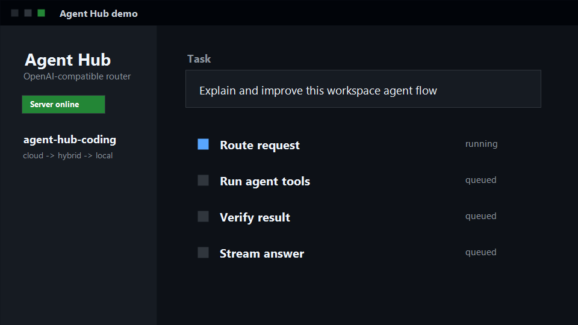
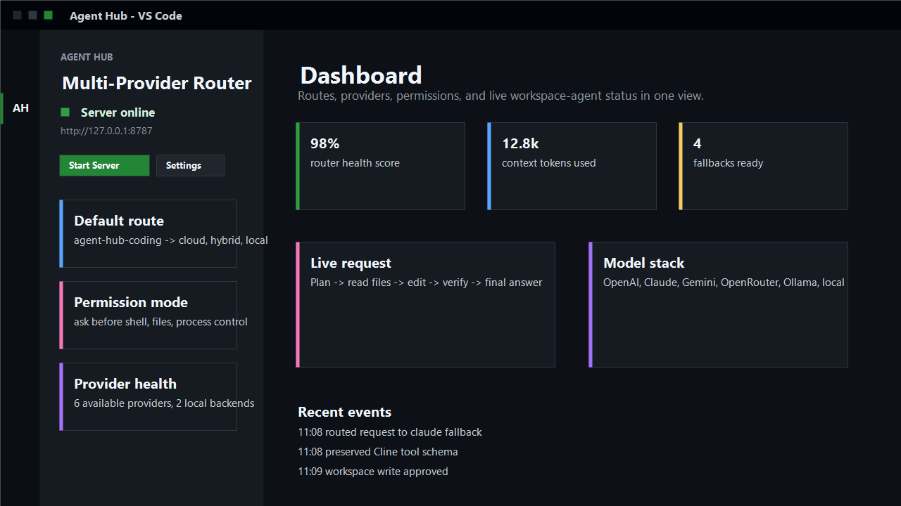
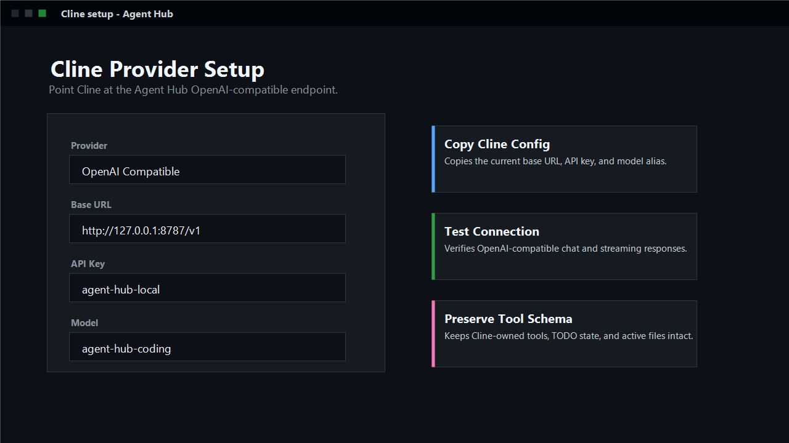

# Agent Hub - Multi-Provider AI Router

Use OpenAI, Claude, Gemini, Ollama, OpenRouter, local models, Cline, Roo Code,
Continue, and coding agents through one local API.



## Install

1. Install the extension.
2. Install Python 3.11 or newer.
3. Open a project folder.

The Agent Hub backend is bundled with the VSIX.

## Use

1. Click the Agent Hub icon.
2. Click `Start`.
3. Type a task.
4. Click `Send`.

Click `Stop` when you are done.

Good first tasks:

- `Explain this file`
- `Find the bug`
- `Fix the failing test`
- `Add a small feature`



## Models

Pick one path:

- Open `Settings` and save an API key.
- Start Ollama or LM Studio locally.
- Connect Cline, Roo Code, Continue, or another OpenAI-compatible tool.

## Cline

Choose `OpenAI Compatible` in Cline:

```text
Base URL: http://127.0.0.1:8787/v1
API Key: agent-hub-local
Model: agent-hub-coding
```



## Safety

Agent Hub asks before sensitive file, shell, process, and provider actions.

## More Help

- [Cline setup](https://github.com/350285449/Agent-Hub/blob/main/docs/CLINE.md)
- [Claude Code setup](https://github.com/350285449/Agent-Hub/blob/main/docs/CLAUDE_CODE.md)
- [Continue setup](https://github.com/350285449/Agent-Hub/blob/main/docs/continue.md)
- [Permissions](https://github.com/350285449/Agent-Hub/blob/main/docs/PERMISSIONS.md)
- [Troubleshooting](https://github.com/350285449/Agent-Hub/blob/main/docs/TROUBLESHOOTING.md)
