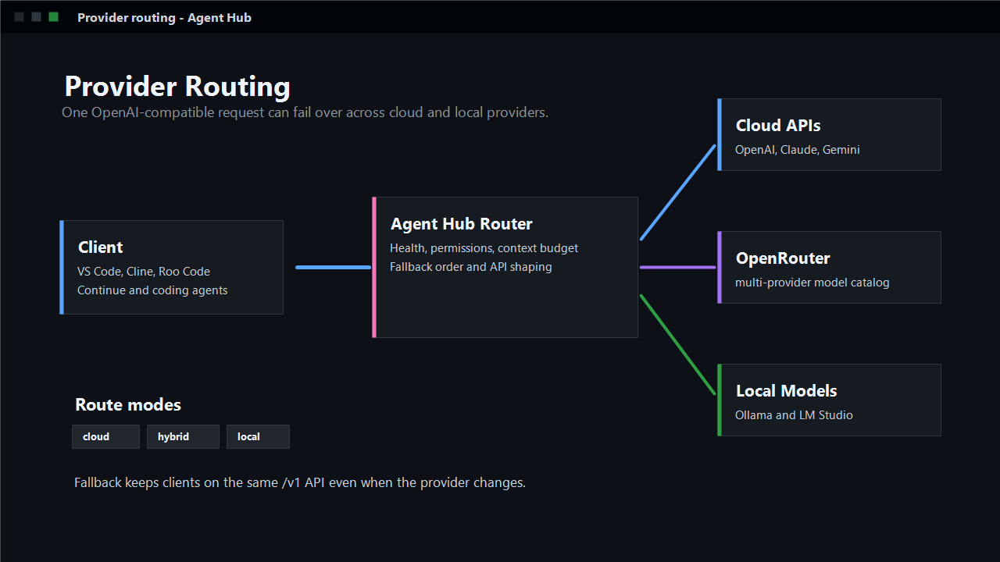

# Agent Hub - Multi-Provider AI Router

One OpenAI-compatible API for OpenAI, Claude, Gemini, Ollama, OpenRouter, local models, Cline, Roo Code, Continue, and coding agents.

## Why Agent Hub?

- Start a coding agent from VS Code
- Use Cline, Roo Code, Continue, and other tools through one local URL
- Switch between cloud and local models without changing each tool
- Fall back to another provider when one fails
- Ask before file edits, shell commands, or other sensitive actions


## Install

1. Install the extension from the Marketplace or install the `.vsix`.
2. Install Python 3.11 or newer.
3. Open a project folder in VS Code.

That is it for the extension. The backend is bundled inside the VSIX. Node.js is
only needed if you build the extension from source.

## First Run

1. Click the Agent Hub icon in the activity bar.
2. Click `Start Agent Hub`.
3. Type what you want done, then click `Send`.

Examples:

- `Explain the current file`
- `Find why the tests fail`
- `Add a settings page`
- `Review this workspace and suggest the next fix`


## Choose Models

Use whichever setup is easiest:

- Cloud/API models: open `Settings`, save your provider key, then start Agent Hub.
- Local models: start Ollama or LM Studio, then use `Choose Local Model`.
- Cline/Roo/Continue: point the tool at Agent Hub's local API URL.

Agent Hub can use OpenAI, Claude, Gemini, Ollama, Ollama Cloud, OpenRouter, LM
Studio, and other OpenAI-compatible providers.

## Use With Cline

In Cline, choose `OpenAI Compatible` and use:

```text
Base URL: http://127.0.0.1:8787/v1
API Key: agent-hub-local
Model: agent-hub-coding
```

Helpful commands:

- `Agent Hub: Copy Cline Config`
- `Agent Hub: Test Cline Connection`
- `Agent Hub: Show Cline Setup`


## How Routing Works

You send one request to Agent Hub. Agent Hub chooses the best configured model
route and can try the next provider if the first one is offline, rate-limited,
or failing.



## Safety

Agent Hub can inspect and edit your workspace only through its permission layer.
For unfamiliar projects, keep approval mode on `ask`, `safe`, or `readonly`.

## Common Commands

- `Agent Hub: Open Chat`
- `Agent Hub: Start Server`
- `Agent Hub: Ask Agent`
- `Agent Hub: Run Coding Agent`
- `Agent Hub: Explain Current File`
- `Agent Hub: Generate Commit Message`
- `Agent Hub: Copy Cline Config`

## More Help

- [Cline setup](https://github.com/350285449/Agent-Hub/blob/main/docs/CLINE.md)
- [Claude Code setup](https://github.com/350285449/Agent-Hub/blob/main/docs/CLAUDE_CODE.md)
- [Continue setup](https://github.com/350285449/Agent-Hub/blob/main/docs/continue.md)
- [Permissions](https://github.com/350285449/Agent-Hub/blob/main/docs/PERMISSIONS.md)
- [Troubleshooting](https://github.com/350285449/Agent-Hub/blob/main/docs/TROUBLESHOOTING.md)
